# Auto-Commit Tool – High-Level Architecture

> Revision: 2025-08-30

This document outlines the overall structure, component interactions, and major design decisions for the **auto-commit** desktop utility.  Diagrams are rendered with Mermaid inside Markdown.

---

## 1  Component Overview

```mermaid
graph TD
    subgraph Core
        FSWatcher["📂 Filesystem Watcher (watchdog)"]
        Debouncer["⏲️ Debouncer Thread"]
        GitAgent["🔧 Git Agent (GitPython)"]
    end

    UI["🖥️ Qt GUI / Tray"] -->|"Add / Remove Repos"| RepoRegistry((Repo Registry))
    RepoRegistry -->|"Repo list"| FSWatcher
    FSWatcher --> Debouncer --> GitAgent
    GitAgent -->|"Status events"| UI

    ConfigStore(["⚙️ Config File (JSON)"])
    UI <-->|"Load / Save"| ConfigStore
    RepoRegistry <-->|"Persist repos"| ConfigStore
```

> **Repo Registry** is an in-memory cache of configured repositories.  Invalid entries are filtered out on startup.

---

## 2  Runtime Sequence – Commit Cycle

---

## 3  Thread Model

1. **Main (Qt) Thread** – handles widgets, system-tray, menu actions.
2. **Watcher Threads** (one per platform watchdog backend) – emit change events.
3. **Debounce Worker** – aggregates events & posts tasks to a **Git Task Queue**.
4. **Git Workers** (ThreadPoolExecuter, max≃4) – run commit/push jobs; capture stdout/stderr.

Qt signals/slots ensure cross-thread UI updates are safe.

---

## 4  Design Decisions & Alternatives

| Area | Options Considered | Choice & Rationale |
|------|--------------------|--------------------|
| **GUI Toolkit** | • PySide6 (Qt 6) • PyQt6 • Tkinter • wxPython • Electron (JS/Node + Chromium) • Web UI (Flask/FastAPI + Browser) | **PySide6** – Native look & feel on Win/Linux, robust system-tray API, LGPL (no commercial fees), wheels on PyPI, lighter footprint (≈40 MB) vs Electron (>150 MB).  Tkinter too basic; wxPython packaging pains; Electron heavy & JS toolchain; Web UI complicates tray integration & file dialogs. |
| **Filesystem Watch** | • watchdog (Python) • OS-specific FFI (inotify/FSEvent/... ) • Simple polling | **watchdog** – Cross-platform wrapper with battle-tested backends; avoids reinventing wheel; single dependency. |
| **Git Integration** | • GitPython • pygit2 / libgit2 • Raw CLI subprocess | **GitPython** – High-level Pythonic API; automatically shells out to system git when faster; easier than low-level libgit2; fewer build issues than pygit2. |
| **Commit Messages** | • Static template w/ timestamp • OpenAI GPT-3.5/4 (paid) • HuggingFace Inference API (limited rate) • Local LLM (llama.cpp, Ollama) | MVP uses *auto-commit TIMESTAMP*.  Future: containerized **Mistral-7B-Instruct** or **CodeLlama-Instruct-7B** via *Text-Generation-WebUI* in Docker w/ CUDA on RTX 3060.  Open-weights, runs ~8-12 GB VRAM. |
| **Packaging** | • PyInstaller / One-File EXE • cx_Freeze • Conda env export | **PyInstaller** for one-click bundles on Windows & Linux; proven with Qt apps. |

---

## 5  Notable Requirements (recap)

* Debounce window configurable (default 2 s).  Adjustable per repo.
* Tray icon with: Open UI · Pause All · Quit.
* Autodetect & optionally **git init** non-repo folders (if user confirms).
* Push only when remote `origin` exists.  Otherwise just commit.
* Use env-var `GH_TOKEN` (configurable key name) for GitHub PAT when needed.
* Persist window geometry & column widths.
* All IO paths use `pathlib.Path` & UTF-8.

---

## 6  Future Work

1. Plug-in architecture for commit-message generators (LLM, heuristic, none).  
2. Auto-update via GitHub releases.  
3. i18n with Qt Linguist.  
4. Unit tests (pytest + pytest-qt) & CI workflow.

---

*End of file*
