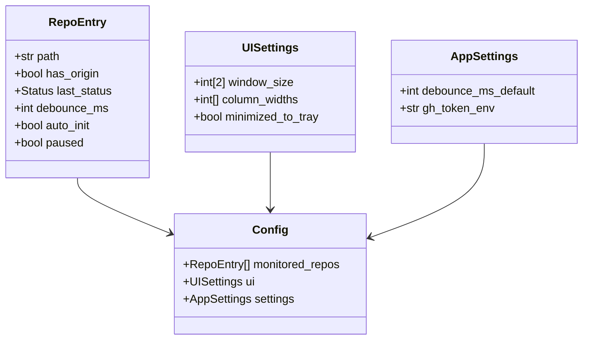

# Data Model

> Revision: 2025-08-30

This document defines the persistent and in-memory data structures used by *auto-commit* and records the design choices.

---

## 1  Entities

### 1.1 `RepoEntry`
Represents a single monitored Git repository.

| Field | Type | Description |
|-------|------|-------------|
| `path` | `str` | Absolute path to repo root. |
| `has_origin` | `bool` | `True` if remote `origin` exists. Derived at runtime. |
| `last_status` | `enum {OK, NO_ORIGIN, ERROR}` | Result of last git operation. Drives status icon colours. |
| `debounce_ms` | `int` | Per-repo override for debounce period (default from settings). |
| `auto_init` | `bool` | If selected folder lacked `.git`, user may opt-in to run `git init`. |
| `paused` | `bool` | Temporarily disable monitoring (set via tray). |

### 1.2 `Config`
Top-level document stored on disk.



### 1.3 `UISettings`
Window geometry, column widths, and whether last session ended in tray mode.

### 1.4 `AppSettings`
Global parameters (default debounce window, the name of env-var for GitHub PAT, etc.).

---

## 2  File Format

* **Location**
  * Windows → `%APPDATA%/auto-commit/config.json`
  * Linux   → `~/.config/auto-commit/config.json`
* **Encoding** : UTF-8 JSON, comments via `//` are **not** allowed to stay standards compliant.

Example:
```json
{
  "monitored_repos": [
    {
      "path": "C:/projects/foo",
      "has_origin": true,
      "last_status": "OK",
      "debounce_ms": 2000,
      "auto_init": false,
      "paused": false
    }
  ],
  "ui": {
    "window_size": [960, 640],
    "column_widths": [420, 120, 120],
    "minimized_to_tray": true
  },
  "settings": {
    "debounce_ms_default": 2000,
    "gh_token_env": "GH_TOKEN"
  }
}
```

---

## 3  Alternatives Considered

| Aspect | Options | Selected & Reason |
|--------|---------|-------------------|
| **Persistence Format** | JSON · YAML · SQLite (SQLCipher) | **JSON** – human-readable, no external libs, trivial with `json` module. YAML needs PyYAML; SQLite overkill for small blobs. |
| **Storage Location** | OS default config dir · ENV-defined path · Registry (Win) | XDG / `%APPDATA%` is cross-platform convention and requires no elevated permissions. |
| **Schema versioning** | None · Semantic version field · JSON-Schema | Add `config_version` field later if breaking changes occur; simple to migrate. |

---

## 4  Change Tracking & UI Events

The Qt GUI emits signals whenever the repository table changes (add/remove/edit). A *ConfigController* listens and immediately serialises the adjusted `Config` object to disk (debounced 300 ms) so that the next launch restores identical state.

---

*End of file*
