# UI & Interaction Design

> Revision: 2025-08-30

This document provides a visual overview of the desktop interface, tray behaviour, and state transitions for *auto-commit*.

---

## 1  Main Window Layout (Wireframe)

```mermaid
graph TD
    style MW fill:#f9f9f9,stroke:#999,stroke-width:1px
    subgraph MW[Main Window]
        direction TB
        SubBar[Toolbar: + Add \| – Remove \| ⚙ Settings]
        RepoTable[[Repo Table]]
        StatusBar[[Status Bar]]
    end
    note over RepoTable
      Columns:
      1. Path
      2. Status Icon
      3. Debounce (ms)
      4. Paused ✓
    end
```

* **Toolbar** – buttons + menu for global actions.
* **Repo Table** – editable cells; double-click Debounce column to override value.
* **Status Bar** – real-time commit/push feedback.

---

## 2  System-Tray Menu


Tray icon colour reflects global state:

| Colour | Meaning |
|--------|---------|
| 🟢 Green | All repos OK / idle |
| 🟡 Yellow | Some repos w/o origin (committing only) |
| 🔴 Red | Recent errors |

---

## 3  UI Event Flow

```mermaid
sequenceDiagram
    autonumber
    participant U as User
    participant GUI as Qt Main Thread
    participant C as ConfigController
    participant FS as FS Watcher

    U->>GUI: Click **Add Folder**
    GUI->>GUI: QFileDialog → path
    alt Path not a git repo
        GUI-->>U: Prompt "Init git?"
        U->>GUI: Yes
        GUI->>GUI: git init
    end
    GUI->>C: addRepo(path)
    C->>C: Saves to config.json
    C-->>FS: registerWatcher(path)
    FS-->>GUI: emits change events → status bar
```



---

## 4  Alternatives Considered

| Element | Options | Selected & Reason |
|---------|---------|-------------------|
| **System-Tray Implementation** | Qt `QSystemTrayIcon` · Separate native lib · No tray (window only) | *QSystemTrayIcon* – built-in, cross-platform, minimal effort. |
| **Multi-window vs Single Window** | Single main window + dialogs · MDI · Tabs | Single – simpler usability; no need for complex document interface. |
| **Status Feedback Placement** | Status bar · Toast pop-ups · Per-row icon only | Combined: Status bar + row icon; gives both global & granular feedback. |

---

*End of file*
